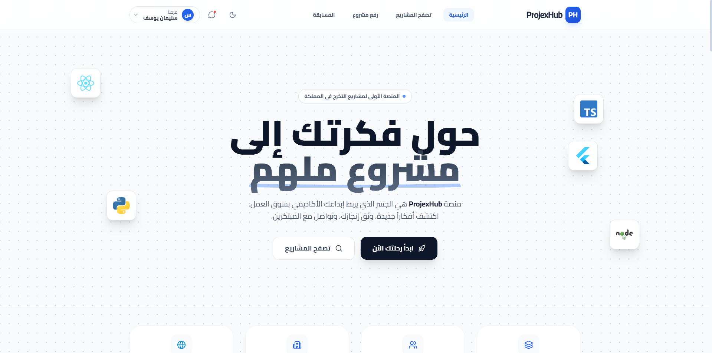

# ProjexHub (بروجيكس هب)
<div align="center">

</div>

**ProjexHub** هو منصة مجتمعية تقنية متكاملة صممت لتكون الوجهة الأولى للمطورين والمبدعين لعرض مشاريعهم، تبادل المعرفة، وبناء شبكة علاقات مهنية قوية. يجمع المشروع بين التصميم العصري والأداء العالي لتوفير تجربة مستخدم استثنائية.

---

##  مميزات المشروع (Key Features)
يتمتع ProjexHub بمجموعة من الخصائص التي تجعله منصة فريدة:

*   **تصميم عصري وجذاب:** واجهة مستخدم (UI) مبنية بعناية لتركز على المحتوى وسهولة الاستخدام.
*   **دعم الوضع المظلم (Dark Mode):** إمكانية التبديل الفوري بين الوضع الليلي والنهاري لراحة العين وتفضيلات المستخدم، مع حفظ الإعدادات تلقائياً.
*   **تجاوب كامل (Responsive Design):** يعمل الموقع بكفاءة على جميع الأجهزة (حواسيب، أجهزة لوحية، وهواتف ذكية).
*   **نظام محاكاة للمستخدمين:** تجربة تسجيل دخول وخروج واقعية مع بيانات مستخدم غنية (الملف الشخصي، المهارات، الروابط الاجتماعية).
*   **أيقونات تفاعلية:** استخدام مكتبة `lucide-react` لإضفاء طابع بصري موحد وجميل.
*   **تصفح سريع:** يعتمد على `React Router` للتنقل السلس بين الصفحات دون إعادة تحميل (SPA).

---

##  التقنيات المستخدمة (Tech Stack)
تم بناء هذا المشروع باستخدام أحدث التقنيات في تطوير الويب:

*   **React 18:** لبناء واجهة المستخدم المعتمدة على المكونات.
*   **TypeScript:** لضمان كتابة كود قوي، آمن، وسهل الصيانة.
*   **Vite:** أداة بناء سريعة جداً لتجربة تطوير سلسة.
*   **Tailwind CSS:** إطار عمل لتنسيق الصفحات بمرونة وسرعة عالية.
*   **React Router DOM:** لإدارة التنقل والمسارات داخل التطبيق.
*   **Lucide React:** مجموعة أيقونات مفتوحة المصدر وأنيقة.

---

##  صفحات المشروع بالتفصيل
يحتوي الموقع على هيكلية منظمة تغطي كافة احتياجات المستخدم:

1.  **الرئيسية (Home):**
    *   واجهة ترحيبية تعرض "Hero Section" جذاب، وقسم لأبرز المشاريع المميزة، ودعوة للتسجيل.

2.  **تصفح المشاريع (Browse Projects):**
    *   مكتبة رقمية تتيح فلترة المشاريع واستعراض بطاقات تعريفية لكل مشروع (اسم المشروع، المطور، نبذة).

3.  **تفاصيل المشروع (Project Details):**
    *   صفحة عميقة لكل مشروع تعرض الوصف الكامل، معرض الصور، رابط المعاينة، الكود المصدري، وتقييمات المستخدمين.

4.  **رفع مشروع (Upload Project):**
    *   نموذج متعدد الخطوات لرفع المشاريع، يتضمن رفع الصور، كتابة الوصف، وإضافة الروابط والتقنيات.

5.  **المنافسات (Competition):**
    *   قسم يعرض الهاكاثونات والتحديات البرمجية المتاحة، مع تفاصيل الجوائز وشروط المشاركة.

6.  **الملف الشخصي (Profile):**
    *   سيرة ذاتية رقمية للمستخدم تعرض: الصورة الرمزية، المسمى الوظيفي، النبذة، المهارات (Tags)، وروابط التواصل الاجتماعي.

7.  **لوحة التحكم (Dashboard):**
    *   مركز عمليات المستخدم، يعرض إحصائيات سريعة (عدد المشاهدات، الإعجابات)، وحالة المشاريع المرفوعة.

8.  **الرسائل (Messages):**
    *   واجهة دردشة تحاكي تطبيقات المراسلة، تتيح التواصل بين المطورين وأصحاب العمل أو المتعاونين.

9.  **الإعدادات (Settings):**
    *   لوحة للتحكم الكامل بالحساب: تغيير كلمة المرور، إعدادات الإشعارات، وتخصيص المظهر.

10. **بوابة الدخول (Auth):**
    *   صفحات تسجيل الدخول وإنشاء الحساب بتصميم بسيط وآمن.

11. **خدمات أخرى:**
    *   **استعادة كلمة المرور (Forgot Password):** لاسترجاع الوصول للحساب.
    *   **تواصل معنا (Contact):** نموذج اتصال مباشر بالإدارة.
    *   **الأسئلة الشائعة (FAQ):** قاعدة معرفة للمساعدة الذاتية.
    *   **الإبلاغ عن مشكلة (Report Issue):** للمساهمة في تحسين المنصة عبر التبليغ عن الأخطاء.

---

##  طريقة التشغيل (How to Run)

لتشغيل المشروع على جهازك المحلي، اتبع الخطوات التالية:

1.  **تثبيت المتطلبات:**
    تأكد من وجود `Node.js` مثبتاً على جهازك.

2.  **تثبيت الحزم:**
    افتح التيرمينال في مجلد المشروع واكتب الأمر:
    ```bash
    npm install
    ```

3.  **تشغيل السيرفر المحلي:**
    لبدء بيئة التطوير، اكتب:
    ```bash
    npm run dev
    ```

4.  **فتح الموقع:**
    سيظهر لك رابط في التيرمينال (عادة `http://localhost:5173`)، قم بفتحه في المتصفح.

---
*تم تطوير هذا المشروع بشغف ليكون منصة ملهمة للمطورين العرب.*
